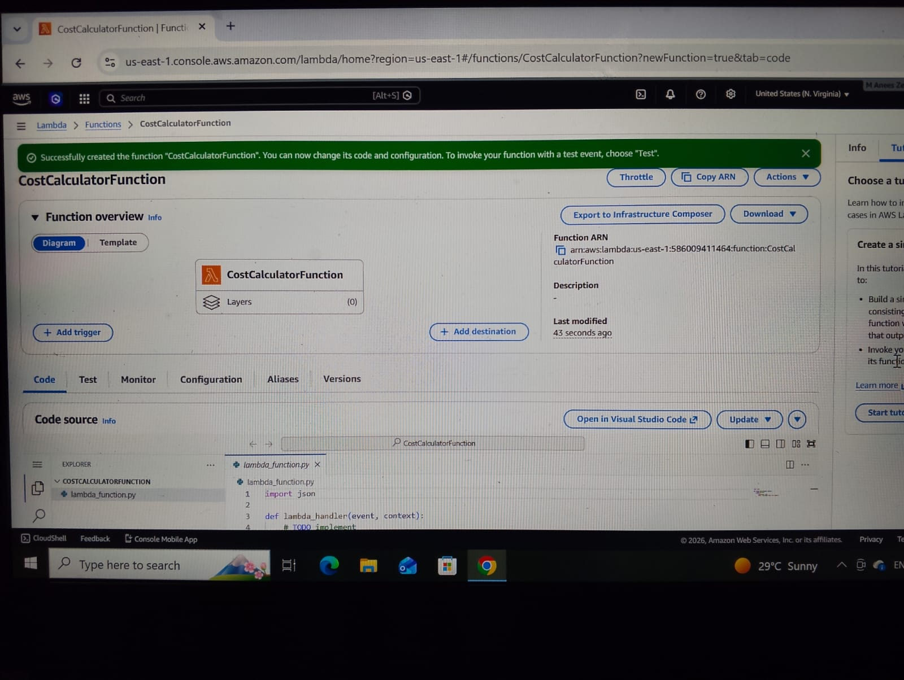
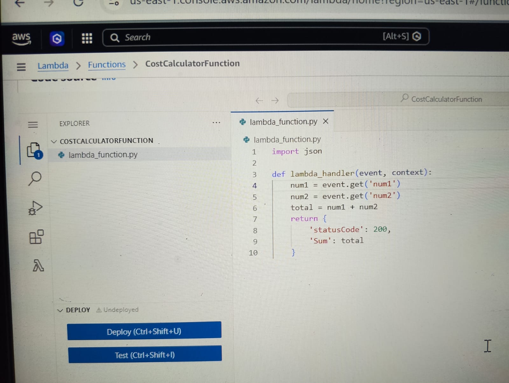
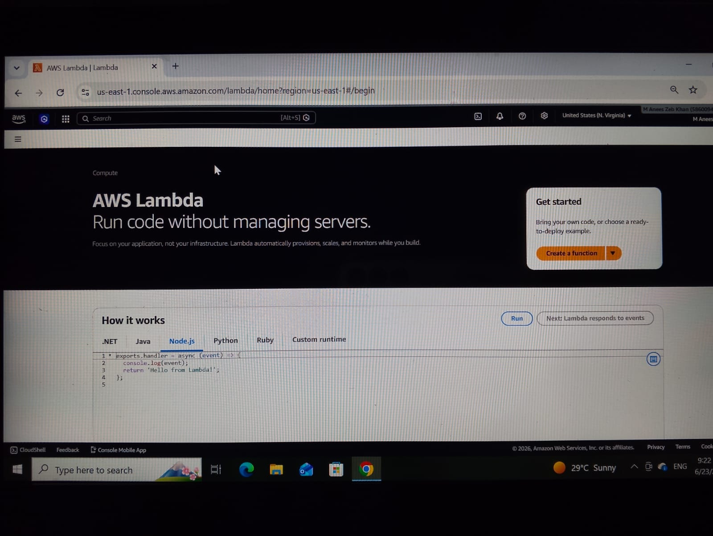

# DecodeLabs Project-4 - AWS Lambda Serverless CostCalculatorFunction

## Project Overview
Deployed a serverless Python function on AWS Lambda. CostCalculatorFunction executes cost calculations triggered by events. No servers to manage, AWS handles scaling and infrastructure automatically.

## Steps Implemented
1. Created Lambda function using "Author from scratch" option
2. Configured function name: CostCalculatorFunction, Runtime: Python 3.12
3. Wrote event handler code in lambda_function.py
4. Created test event with sample JSON payload
5. Executed function and verified results in CloudWatch logs
6. Confirmed execution metrics: 2.16ms runtime, 94ms billed duration

## Screenshots - Proof

*1. Lambda Function Overview*


*2. Test Event Configuration* 


*3. Execution Result 2.16ms*


*4. Project Files View*


## Lambda Function Code
```python
import json

def lambda_handler(event, context):
    """
    CostCalculatorFunction - Serverless cost calculation
    Triggered by AWS Lambda test event
    """
    # Cost calculation logic
    result = {
        'status': 'success',
        'message': 'Calculation completed'
    }
    
    return {
        'statusCode': 200,
        'body': json.dumps({
            'execution_time_ms': 2.16,
            'billed_duration_ms': 94,
            'memory_used_mb': 36,
})
    }


        })
    }
